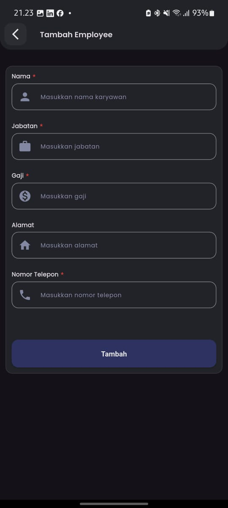
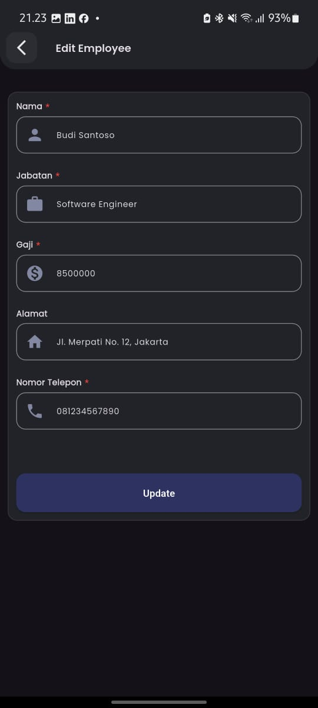
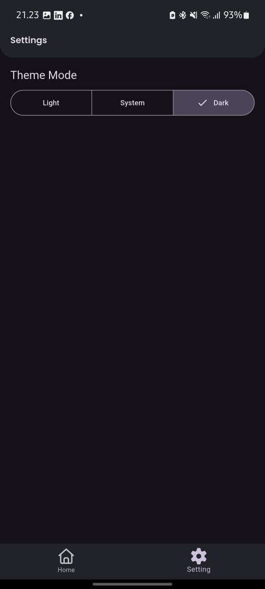

# Test Qtasnim - Flutter Technical Task

This Flutter application was developed as a technical task.  
It implements a set of features including an **Employee Management App** (CRUD employees with REST API) and a **Settings screen**.

---

## ✨ Key Features

- **Employee Management:**  
  - Full CRUD (Create, Read, Update, Delete) functionality with **json-server** backend.  
  - Swipe-to-delete with confirmation dialog.  
  - Search .  
  - Add/Edit employee in a single screen.  

- **Settings Page:**  
  - Basic settings layout (expandable for real use).  

- **UI/UX:**  
  - Custom AppBar & Employee Card widgets.  
  - Responsive design with **flutter_screenutil**.  
  - etc.
---

## 📸 Application Screenshots

Here is a showcase of the application's user interface.

| Home Screen | Add Employee | Edit Employee |
| :---: | :---: | :---: |
|  |  |  |

| Settings Screen |
| :---: |
|  |

---

## 🛠️ Tech Stack & Architecture

- **Architecture:** Bloc pattern with Repository & DI (Dependency Injection)  
- **State Management:** **Flutter BLoC / Freezed**  
- **Navigation:** **auto_route**  
- **Networking:** **dio + pretty_dio_logger + dio_smart_retry**  
- **Dependency Injection:** **injectable + get_it**  
- **Local Storage:** **shared_preferences**  
- **UI:** Material 3 + **google_fonts** + **flutter_screenutil**  

---

## 🚀 Getting Started

Follow these instructions to get the project running locally.

### 1. Prerequisites
- Flutter SDK (^3.9.2)  
- Node.js (for json-server)  

### 2. Clone & Install Dependencies
```bash
git clone <YOUR_REPOSITORY_URL>
cd test_qtasnim

flutter pub get
